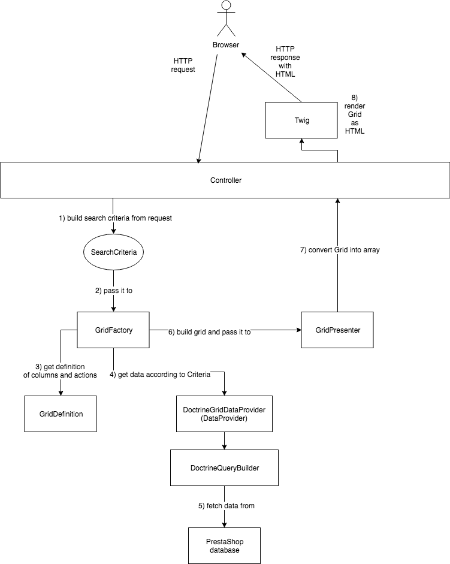

# How to migrate a CRUD page of Back Office?

Looking at PrestaShop Back Office, most of the pages are organized the same way.

We can already see 2 categories of pages that represent almost 90% of back office:

* **Configuration** pages: forms that alter the configuration;
* **CRUD** pages: pages with a filtereable/searchable table of data and some options to access a form of creation/edition;

CRUD pages provide a lot of features.

Access to a lot of data, ordered by column: this data can be simple (text) or more complex (display a thumbnail).
These columns are ordered and can be altered by developers: we can change position, add or remove columns for instance.

All tables are paginated and can be filtered by value for a specific column, for instance re-organize the value ordered by decreasing price.

More, all tables can be filtered using criteria: each column may define it's filter and can be used to build the data.

Finally, all tables are provided with common actions: export, access to SQL manager, ... and common bulk actions.


In PrestaShop, all modern CRUD pages are managed by the Grid component.

## The Grid component

The Grid component define for a Grid (Table + action + bulk actions) the definition of columns, the query builder used to retrieve data and how the search filters must be used to retrieve the data displayed.

Not only this give a consistent representation of the data from a "PHP/Back" point of view, but the component also provide a minimalist Twig/Javascript layer for the rendering based on a typed View model.

Because every PrestaShop developer must be able to alter the grid we provide in the core, the following units can be changed:

* The **Columns** (their position, add new ones or update/remove existing ones)
* The **Query Builder** (which is used to retrieve the data according to the Search criteria if any)


Let's see what we need to do to migrate a CRUD-based page, in step-by-step tutorial:

* The **Grid Definition**
* The **Grid Data Provider**
* The **Grid Query Builder**

### The Grid Definition

The Grid Definition stores the structural information about your Grid:

* The *name* is the human readable and translatable name
* The *id* is a unique key that you can use to identify grid in page or hook
* The *columns* defines columns for grid, it needs to be an instance of ColumnCollection
* The *grid actions* are the related actions available for this grid: in PrestaShop it's common to have "export" or "access to sql manager" actions.
* The *bulk actions* are the actions available for a bunch of selectable entries: a bulk delete or a bulk activate for instance.

You don't have to create the Grid Definition by yourself but rely instead on a Grid Definition Factory.

This factory must implement the `GridDefinitionFactoryInterface` interface which has only one method: `create()`.
It is recommended to use the abstract factory class provided by the component, which gives you access to the translator and implements re-usable functions for you:

NOTE: every column must be defined in `getColumns()` method. Column can be as simple as `DataColumn` to display field from row or it can be `BulkActionColumn` to display checkbox with value from row. 

```php
use PrestaShop\PrestaShop\Core\Grid\Action\GridAction;
use PrestaShop\PrestaShop\Core\Grid\Action\GridActionCollection;
use PrestaShop\PrestaShop\Core\Grid\Column\ColumnCollection;
use PrestaShop\PrestaShop\Core\Grid\Column\Type\Common\BulkActionColumn;
use PrestaShop\PrestaShop\Core\Grid\Column\Type\DataColumn;

final class FooGridDefinitionFactory extends AbstractGridDefinitionFactory
{
    // required
    protected function getId()
    {
        return 'foo';
    }

    protected function getName()
    {
        return $this->trans('Foo', [], 'Admin.Advparameters.Feature');
    }

    // required
    protected function getColumns()
    {
        return (new ColumnCollection())
            ->add((new BulkActionColumn('bulk_action'))
                ->setOptions([
                    'bulk_field' => 'id_log',
                ])
            )
            ->add((new DataColumn('id_log'))
                ->setName($this->trans('ID', [], 'Global.Actions'))
                ->setOptions([
                    'field' => 'id_log',
                ])
            )
        ;
    }

    // null by default and should not be implemented if grid does not define actions
    protected function getGridActions()
    {
        return (new GridActionCollection())
            ->add(new GridAction(
                'common_refresh_list',
                $this->trans('Refresh list', [], 'Admin.Advparameters.Feature'),
                'refresh',
                'simple'
            ))
            ->add(new GridAction(
                'common_show_query',
                $this->trans('Show SQL query', [], 'Admin.Actions'),
                'code',
                'simple'
            ))
            ->add(new GridAction(
                'common_export_sql_manager',
                $this->trans('Export to SQL Manager', [], 'Admin.Actions'),
                'storage',
                'simple'
            ))
        ;
    }
}
```

### The Grid Data Provider

As you can imagine, the responsibility of Grid Data Provider is to provide the Grid data, from the Grid Definition and using the Grid Query Builder.

The only method available of `GridDataProviderInterface` is `getData` which returns an instance of `GridData`.
A GridData is an immutable object used to store and retrieve the GridData, so if you want to alter this data, you must do it in Grid Data Provider *before* the GridData creation.

There is a good news here: you don't need to create your own as we provide one: the `DoctrineGridDataProvider`. 

### The Grid Query Builder

Probably the most difficult and important piece of this component.
The Grid Query Builder is responsible of retrieving the data according to the Grid Definition and Search filters that come from the request for instance.

This is the related interface:

```php
interface DoctrineQueryBuilderInterface
{
    /**
     * Get query that searches grid rows
     *
     * @param SearchCriteriaInterface|null $searchCriteria
     *
     * @return QueryBuilder
     */
    public function getSearchQueryBuilder(SearchCriteriaInterface $searchCriteria = null);

    /**
     * Get query that counts grid rows
     *
     * @param SearchCriteriaInterface|null $searchCriteria
     *
     * @return QueryBuilder
     */
    public function getCountQueryBuilder(SearchCriteriaInterface $searchCriteria = null);
}
```

Once you have defined the right Query Builder for your data, let's configure the grid and use it in a controller.

## Grid services declaration

Only 3 services must be declared: the *Grid Factory*, the *Grid Definition Factory*, and the *Grid Data Provider*.
```yaml
# In src/PrestaShopBundle/Resources/config/services/core/grid.yml

# Grid Factory
prestashop.core.grid.factory.foo:
    class: 'PrestaShop\PrestaShop\Core\Grid\GridFactory'
    arguments:
        - '@prestashop.core.grid.definition.factory.foo'
        - '@prestashop.core.grid.data_provider.foo'
        - '@form.factory'
        - '@prestashop.hook.dispatcher'

# Grid Definition Factory
prestashop.core.grid.definition.factory.foo:
    class: 'PrestaShop\PrestaShop\Core\Grid\Definition\Factory\FooGridDefinitionFactory'
    parent: 'prestashop.core.grid.definition.factory.abstract_grid_definition'
    public: true

## Grid Data Provider
prestashop.core.grid.data_provider.foo:
    class: 'PrestaShop\PrestaShop\Core\Grid\DataProvider\DoctrineGridDataProvider'
    arguments:
        - '@prestashop.core.admin.foo.query_builder'
        - '@prestashop.hook.dispatcher'
```

## Use in the Controller and template rendering

In Back Office controllers, you can use the Grid Factory to create a Grid and return it:

```php
use Symfony\Component\HttpFoundation\Request;
use Symfony\Component\HttpFoundation\Response;

class FooController extends FrameworkBundleAdminController
{
    /**
     * Note: the Search Criteria management is part of another PR.
     */
    public function indexAction(SearchCriteria $searchCriteria)
    {
        $gridFooFactory = $this->get('prestashop.core.grid.factory.foo');
        $fooGrid = $gridLogFactory->createUsingSearchCriteria($searchCriteria);
        
        // presenter will convert grid to plain array
        $gridPresenter = $this->get('prestashop.core.grid.presenter.grid_presenter');
        $presentedGrid = $gridPresenter->present($fooGrid);
        
        return $this->render('@Foo/Bar/pageWithGrid.html.twig', [
            'grid' => $presentedGrid,
        ]);
    }
}
```

And in the related template:

```twig
    {{ include('@PrestaShop/Admin/Common/Grid/grid_panel.html.twig', {'grid': grid }) }}
```

## Summary as a schema


